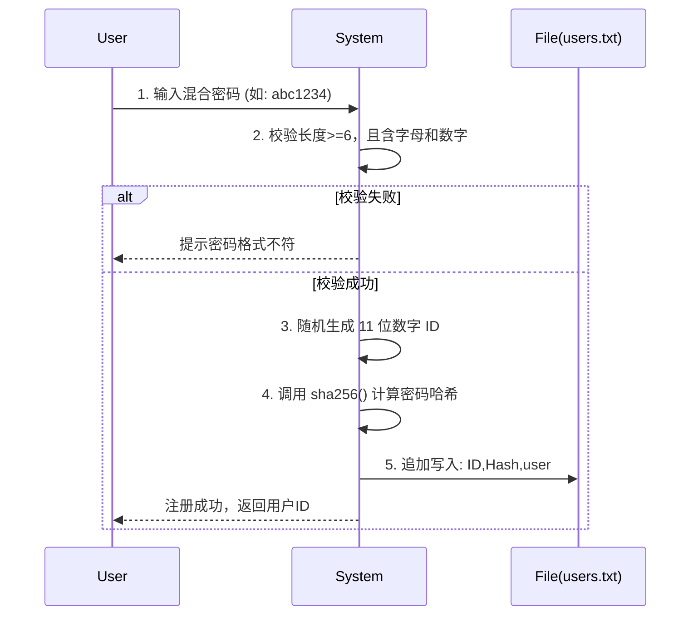
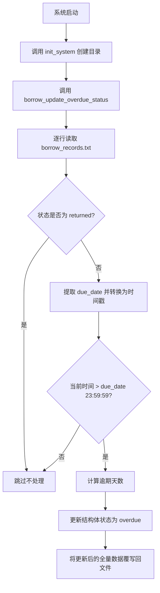

# 图书管理系统 (C Book Library)

> **📝 获取源码说明**
> 
> 本项目为作者的原创作品。如果您希望获取完整的源代码用于学习或二次开发，请联系作者 QQ：**1792243149**。
> 
> 为了支持作者持续创作与维护，获取源码需支付 **99元** 作为辛苦费支持，感谢您的理解与支持！🙏

本项目是一个基于纯 C 语言（C99 标准）实现的命令行交互式图书管理系统。项目旨在通过无第三方依赖的原生实现，展示文件 I/O、纯 C 加密算法、动态数据处理以及控制台交互设计等核心基础能力。

## 1. 技术栈与运行环境

### 🛠 技术栈
- **核心编程语言**: 纯 C 语言 (基于 C99 标准)，全程无任何第三方库依赖。
- **数据持久化**: 原生文件 I/O，采用格式化纯文本（`txt`）实现本地数据存储与解析。
- **安全加密**: 纯 C 手写实现的 SHA-256 哈希算法，用于用户密码的安全加密与校验。
- **构建工具**: [xmake](https://xmake.io/) (现代化、跨平台的 C/C++ 构建工具)。
- **用户界面**: 命令行终端界面 (CLI)，支持对齐的表格化视图输出与动态菜单路由。

### 💻 运行环境
- **操作系统**: Windows (兼容 Linux/macOS)
- **编译器**: 支持 GCC (>= 8.1.0) / Clang / MSVC 等主流编译器
- **语言标准**: C99

---

## 2. 系统功能模块与演示

系统主要分为管理员端与用户端，提供以下核心功能。*(注：以下演示图片需在实际运行后截图并放置于 `assets/` 目录下)*

### 🔐 认证与权限 (Auth)
- **管理员登录**：通过预配置（`config.h`）密码比对登录。
- **用户注册**：自动生成唯一的11位数字ID，强制要求包含字母与数字的混合密码（纯C实现 SHA-256 哈希加密存储）。
- **用户登录**：账号与密码验证。

```text
欢迎使用图书管理系统
请选择登录方式：
  1. 管理员登录
  2. 用户登录
  3. 用户注册
  0. 退出系统
请输入选项：3

--- 用户注册 ---
请输入姓名: 张三
请输入性别(男/女): 男
请输入年龄: 25
请输入联系方式(电话): 13800138000
请输入住址: 北京市朝阳区
请设置您的密码 (长度 >= 6, 必须同时包含字母和数字): ********
注册成功！
您的用户ID为: 13800138000 (请妥善保管，登录时需要使用)
```

### 📚 图书管理 (Book) - 管理员权限
- **添加图书**：录入书名、作者、出版社、日期、价格、库存（附带非负整数校验）、分类等，自动生成图书ID（BXXXXXX）。
- **删除图书**：根据图书ID删除记录。
- **查询图书**：
  - 支持按添加时间倒序展示默认列表（表格化输出并对齐）。
  - 支持按图书ID精确查询。
  - 支持按书名/作者关键字模糊查询。
  - 支持按分类等字段组合过滤查询。

```text
=== 管理员菜单 ===
  1. 添加图书
  2. 删除图书
  3. 查询图书
  4. 查看所有借阅记录
  5. 查询用户信息
  0. 退出登录
请输入选项：3

--- 查询图书 ---
请选择查询方式：
1. 按图书ID精确查询
2. 按书名或作者模糊查询
3. 按分类过滤查询
4. 默认查询(按添加时间倒序)
请输入选项(直接回车默认4): 

查询到 1 条结果:
图书ID     | 书名                      | 作者            | 出版社               | 出版日期     | 价格     | 库存   | 分类           
---------------------------------------------------------------------------------------------------------------------------------------
B000001    | C程序设计语言             | K&R             | 机械工业出版社       | 2004-01-01   | 35.00    | 10     | 计算机科学     
```

### 🔄 借阅管理 (Borrow)
- **借阅图书 (用户)**：检查库存与个人借阅上限（最多3本），借阅成功后库存减一，记录借阅时间与归还截止日期（默认+14天）。
- **归还图书 (用户)**：归还图书，恢复库存，重置借阅状态。
- **查看个人记录 (用户)**：表格化展示当前用户的所有借阅历史及书籍详情。
- **查看所有记录 (管理员)**：
  - 默认按借阅时间倒序查看所有用户的借阅行为。
  - **逾期追踪**：支持按逾期天数倒序查询仅状态为 `overdue` 的记录，方便管理员催还。

```text
--- 查看所有借阅记录 ---
1. 默认查询(按借阅时间倒序)
2. 按逾期天数倒序查询
请输入选项(直接回车默认1): 
共有 1 条记录：
记录ID                              | 账号ID          | 借阅人姓名      | 书名(图书ID)              | 借阅日期        | 归还截止        | 状态       | 逾期天数
-----------------------------------------------------------------------------------------------------------------------------------------------------------
R13800138000B00000120260326123456   | 13800138000     | 张三            | C程序设计语言(B000001)    | 2026-03-26      | 2026-04-09      | borrowed   | 0       
```

### 📝 系统日志 (Log)
- 记录系统内关键操作（如：用户登录/注册、管理员增删图书等），追加至独立的 `logs/system.log` 文件。

```text
[2026-03-26 10:00:00] [INFO] [Admin] Admin logged in
[2026-03-26 10:05:00] [INFO] [Admin] Admin added book: B000001
[2026-03-26 10:10:00] [INFO] [13800138000] New user registered: 13800138000 (张三)
[2026-03-26 10:15:00] [INFO] [13800138000] User logged in
[2026-03-26 10:20:00] [INFO] [13800138000] Borrowed book B000001
```

---

## 3. 代码目录与文件结构

```text
c-book-library/
├── build/                  # xmake 自动生成的编译产物及运行目录
├── config/
│   └── config.h            # 系统全局配置文件（存储路径宏、默认密码等）
├── data/                   # 本地持久化数据存放目录（按需自动创建）
│   ├── books.txt           # 图书信息存储
│   ├── borrow_records.txt  # 借阅流水记录
│   └── users.txt           # 用户账号与密码哈希存储
├── include/                # 头文件声明目录
│   ├── auth.h              # 认证与加密接口
│   ├── book.h              # 图书结构与业务接口
│   ├── borrow.h            # 借阅记录结构与业务接口
│   ├── log.h               # 日志写入接口
│   └── user.h              # 用户结构与查询接口
├── logs/                   # 系统运行日志存放目录（按需自动创建）
│   └── system.log          # 操作日志追加记录文件
├── src/                    # 源代码实现目录
│   ├── auth.c              # SHA-256 算法及登录注册逻辑实现
│   ├── book.c              # 图书增删改查实现
│   ├── borrow.c            # 借阅、归还及逾期状态结算实现
│   ├── log.c               # 日志时间格式化与写入实现
│   ├── main.c              # 程序主入口、菜单路由与安全交互实现
│   └── user.c              # 用户信息读取实现
└── xmake.lua               # xmake 项目构建描述文件
```

---

## 4. 核心功能代码解释与流程图

### 4.1 纯 C 实现的 SHA-256 与用户认证
为遵守不使用任何第三方依赖的要求，项目在 `src/auth.c` 中从零实现了标准的 SHA-256 算法（涉及位移、填充和 64 次迭代轮计算）。在用户注册时，不会存储明文密码，而是存储经过计算的 64 位十六进制哈希值。



### 4.2 借阅管理与自动逾期结算
借阅记录使用追加方式写入 `borrow_records.txt`。为了保持数据的一致性和实效性，系统在每次启动（`main.c` 运行）时，会自动触发 `borrow_update_overdue_status` 函数。

该函数会扫描所有状态非 `returned` 的记录，利用 `<time.h>` 提取归还截止时间并与当前时间戳比对。如果发现跨过了截止日的午夜（23:59:59），则将状态更新为 `overdue` 并重新计算具体的逾期天数覆写回文件。



---

## 5. 编译打包与启动指导

项目统一采用 `xmake` 进行构建和依赖管理，同时兼顾了控制台的字符集编码（全流程统一使用 GBK 编码防止 Windows 终端中文乱码）。

### 5.1 安装 Xmake (Windows)
在 PowerShell 中以管理员身份运行以下命令：
```powershell
Invoke-Expression (Invoke-Webrequest 'https://xmake.io/psget.text' -UseBasicParsing).Content
```

### 5.2 编译与打包

#### 方式一：使用 xmake 编译（推荐）
在项目根目录（`c-book-library`）下打开终端，执行：
```bash
xmake build
```
执行完毕后，xmake 会根据你的系统平台（如 Windows x64）在 `build\windows\x64\release` 或相应架构文件夹下生成 `book_manager.exe`。

#### 方式二：使用 GCC / MinGW 编译
如果你使用 GCC（如 MinGW-w64）进行手动编译，请在项目根目录下执行以下命令：

**Windows (MinGW-w64)**
```bash
gcc -o book_manager.exe `
    -I include -I config `
    src/main.c src/auth.c src/book.c src/borrow.c src/log.c src/user.c `
    -D _CRT_SECURE_NO_WARNINGS -D _WIN32 `
    -Wall -Wextra -std=c99
```

**Linux / macOS**
```bash
gcc -o book_manager \
    -I include -I config \
    src/main.c src/auth.c src/book.c src/borrow.c src/log.c src/user.c \
    -Wall -Wextra -std=c99
```

### 5.3 运行项目
推荐直接使用 xmake 提供的快捷运行指令（它会自动为你设定好运行路径和环境变量）：
```bash
xmake run
```
*注：系统首次启动时会自动在工作目录下创建 `data` 与 `logs` 文件夹。*

---

## 6. 其他必要信息与默认配置

- **管理员账号与密码**：
  - 用户名：直接在菜单选择“管理员登录”
  - 密码：**`123456`**（此默认密码定义在 `config/config.h` 的 `ADMIN_DEFAULT_PASSWORD` 宏中，修改后需重新编译生效）。
- **预置测试数据**：
  - 项目已在构建目录预置了部分经典书籍和测试账号（如 ID `13800138000`，密码 `123456a`），可以直接登录体验。
- **关于编译警告**：
  - `xmake.lua` 中已经通过宏 `_CRT_SECURE_NO_WARNINGS` 和 `/W4` 级别适配了 MSVC 的安全检查，确保项目能够在最为严格的编译器参数下达成 **“零警告、零错误”**。
